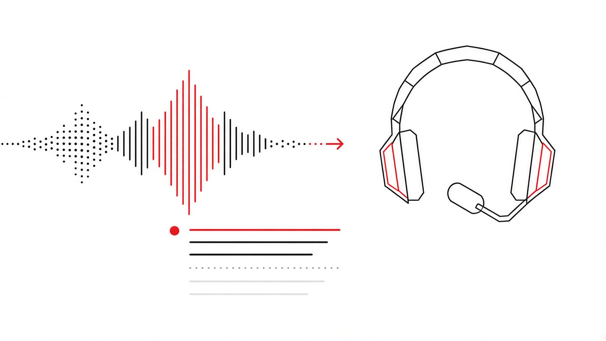

<p align="center">
  
</p>

<h1 align="center">speech-to-text-lab</h1>

<p align="center">
  <strong>Educational ALO 124 / TÜİK-style speech-to-text laboratory</strong><br />
  Synthetic and demo audio only · Not an official TÜİK product
</p>

<p align="center">
  <a href="https://github.com/masterfabric/speech-to-text-lab"></a>
  
  
  
  
  
</p>

<p align="center">
  
</p>

## About

`speech-to-text-lab` is a **browser-based teaching lab** for call-center style audio workflows:

**audio → speech-to-text (STT) → sentiment / emotion → analysis report**

It was built under **AI transformation** and **AI literacy** training. The core lab runs locally with **synthetic / demo samples** — there are no real ALO 124 recordings and no citizen personal data in the repository. Paid cloud STT APIs are **not** required for the default Mock ASR path.

> The TÜİK logo appears only in an educational / demo context. This repository is **not** an official TÜİK product, endorsement, or publication.

### Who it is for

- Instructors demonstrating STT + NLP pipelines without provisioning cloud keys
- Analysts / representatives practicing on **demo** audio in a safe sandbox
- Learners exploring VAD, keyword spotting, and hybrid decode stages visually

## Features

| Area | What you get |
| --- | --- |
| **Single-file lab** | Minimal (player + waveform) and Detail (catalog + cards) audio stages |
| **Samples & upload** | Common Voice TR–style demos + local WAV / MP3 / M4A drop zone |
| **STT modes** | Five educational engines (see below) |
| **Sentiment** | Offline Turkish lexicon → polarity + emotion scores |
| **Metrics & WER-ish** | Duration, speaking ratio, silence gaps, keyword hits, reference WER when available |
| **Reports** | On-screen analysis + PDF / TXT / JSON export |
| **Batch** | Multi-file processing panel |
| **NLP / OpenCode** | Optional browser NLP + optional local **OpenCode** desktop CLI bridge |
| **i18n** | Footer switcher **TR · EN · FR · CN · JP · AR** (Arabic sets `dir="rtl"`) |
| **Onboarding** | Path `/onboarding`: splash → short tour → name + KVKK form (Web3Forms); **Approved** badge after accept; main lab gated until then |
| **Theme** | Black / white + TÜİK red `#ae1615` · **Lucide** icons only (no emoji) |

## Techniques & STT modes

Educational engines (selectable in the sidebar) — labels may appear in Turkish in the engine cards themselves; behavior is mode-driven:

| Mode | Idea |
| --- | --- |
| **Mock ASR** (recommended) | Deterministic offline transcripts for known demo files; ideal for metrics / sentiment / WER demos |
| **Web Speech API** | Browser `SpeechRecognition` when available; falls back to Mock |
| **Pipeline stages** | Visible path: VAD → features → mock decode |
| **Energy / VAD + n-gram hybrid** | Explicitly labeled teaching hybrid (not Whisper); energy VAD + small Turkish n-gram scoring |
| **Keyword spot + acoustic confidence** | Offline keyword scan + SNR-like confidence; full sentence text still MOCK for known samples |

Related teaching surfaces: live **pipeline stage** cards, **waveform** scrubbing, and **word timings** tables.

## Architecture (high level)

```text
app/                  Next.js App Router (layout → AppShell client chrome)
components/           Lab workspace, panels, footer, i18n + consent gate
lib/
  i18n.ts             Locale dictionaries + t(key)
  consent.ts          localStorage consent + TODO hook for future form API POST
  stt-pipeline.ts     Mode router → mock / web-speech / pipeline / hybrids
  sentiment*.ts       Offline TR sentiment
  export-pdf.ts       jsPDF reports
public/samples/       Demo audio (generated / synced by scripts)
slides/               Presentation deck (served separately)
```

Client chrome (`LocaleProvider`, `ConsentProvider`, `SiteFooter`) wraps the server layout so language and first-visit consent work without turning the whole tree into a server-only surface.

Consent is stored under `stt-lab-consent-v1`. Locale under `stt-lab-locale-v1` (default **TR**).

### Onboarding (`/onboarding`)

1. **Splash** under the TÜİK logo — feature list + ready state  
2. **Short tour** — how to use the lab  
3. **Form + KVKK** — required fields: **first name**, **last name**, **why you use the lab**, **consent checkbox**  
4. Submit via **Web3Forms** from the **browser** (`POST https://api.web3forms.com/submit`) using `NEXT_PUBLIC_WEB3FORMS_ACCESS_KEY` (domain-restricted public key; free plan does not allow server-IP submit)  
5. On success: write localStorage consent, show **Approved** badge, continue to the main lab  

```bash
cp .env.example .env.local
# set NEXT_PUBLIC_WEB3FORMS_ACCESS_KEY=...
```

## OpenCode (optional)

The **NLP / OpenCode** tab can enrich analysis via a **local** OpenCode desktop CLI bridge (`app/api/opencode/*`). The lab itself does not require a paid model API. Install OpenCode on the machine if you want agent results; use the in-app install accordion and model picker when present. Review prompts and outputs before sharing.

## Internationalization (i18n)

- Footer bottom-right control: **TR · EN · FR · CN · JP · AR**
- Switching updates `document.documentElement.lang` and `dir` (**rtl** for AR)
- Chrome strings: header, privacy banners, footer, LabWorkspace tabs/steps, upload / STT chrome, major panel headings
- Dictionaries live in `lib/i18n.ts`; React access via `useLocale().t(key)`

## Privacy / KVKK / disclaimer

- **Educational use only.** Do not upload real ALO 124 calls, CATI answers, or personal data.
- Demo audio in `public/samples/` is synthetic or openly licensed material for teaching.
- First visit requires acknowledging KVKK-oriented **correct use** and local-only persistence of consent.
- In production environments, follow **KVKK** and institutional policies.
- Onboarding profile fields are submitted from the browser to **Web3Forms** using `NEXT_PUBLIC_WEB3FORMS_ACCESS_KEY` (see `.env.example`).
- OpenCode CLI (if installed) runs on your machine; review outputs before sharing.

## Quick start

```bash
git clone https://github.com/masterfabric/speech-to-text-lab.git
cd speech-to-text-lab
npm install
npm run dev
```

Open **http://127.0.0.1:43123** (Next.js is bound to port `43123`).

| Script | Purpose |
| --- | --- |
| `npm run dev` | Local development server |
| `npm run build` | Generate samples, sync slides, production build |
| `npm run start` | Serve the production build on port `43123` |
| `npm run samples` | Regenerate demo audio under `public/samples/` |
| `npm run slides` | Serve presentation slides (port `43210`) |
| `npm run lint` | ESLint |

## Stack

- **Next.js** (App Router) + **React** + **TypeScript**
- **Tailwind CSS** v4
- **Lucide React** icons
- **WaveSurfer.js** waveform
- **jsPDF** report export
- Optional local **OpenCode** CLI for agent enrichment

## Credits

- Instructor engineer: **[Gürkan Fikret Günak](https://linkedin.com/in/gurkanfikretgunak)**
- Developed with resources from **[MasterFabric](https://masterfabric.co)**
- Logo © Türkiye İstatistik Kurumu — educational display only

## License

[MIT](./LICENSE)
